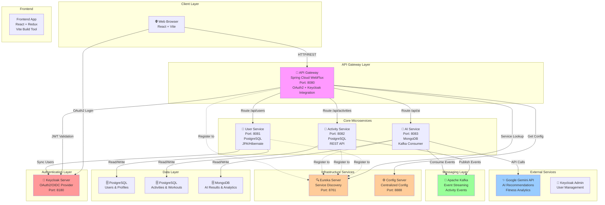

# Fitness - Microservices Platform

A comprehensive **Java Spring Boot-based microservices architecture** for a fitness application. This project demonstrates a distributed system with service discovery, API gateway, Keycloak OAuth2 authentication, asynchronous messaging, and AI-powered recommendations using Google Gemini API.

---

## 🏗️ System Architecture Overview



---

## 📋 Services Overview

| Service | Port | Technology | Purpose |
|---------|------|-----------|---------|
| **Eureka Server** | 8761 | Spring Cloud Eureka | Service Discovery & Health Checks |
| **Config Server** | 8888 | Spring Cloud Config | Centralized Configuration Management |
| **API Gateway** | 8080 | Spring Cloud WebFlux | Request Routing & Security |
| **User Service** | 8081 | Spring Boot + PostgreSQL + JPA | User Authentication & Profiles |
| **Activity Service** | 8082 | Spring Boot + PostgreSQL | Activity Tracking & Management |
| **AI Service** | 8083 | Spring Boot + MongoDB + Kafka | AI Recommendations via Gemini API |
| **Keycloak** | 8180 | Keycloak Server | OAuth2/OIDC Authentication |

---

## 🚀 Technology Stack

### Backend
- **Framework**: Spring Boot 4.0.1
- **Java Version**: 25
- **Spring Cloud**: 2025.1.0
- **Service Discovery**: Spring Cloud Eureka Netflix
- **API Gateway**: Spring Cloud Gateway with WebFlux
- **Security**: Spring Security + OAuth2 Resource Server
- **Configuration**: Spring Cloud Config Server

### Databases
- **PostgreSQL**: User & Activity data persistence
- **MongoDB**: AI service analytics and results
- **Caching**: Redis (optional, for performance optimization)

### Messaging & Async
- **Apache Kafka**: Event streaming for asynchronous communication
- **Kafka Topics**: Activity events, recommendations, notifications

### External APIs & Services
- **Google Gemini API**: AI-powered recommendations and analysis
- **Keycloak**: OAuth2/OIDC for centralized authentication

### Frontend
- **Framework**: React 18+
- **Build Tool**: Vite
- **State Management**: Redux
- **Authentication**: Keycloak OAuth2
- **HTTP Client**: Axios/Fetch API

---

## 🔐 Authentication & Security

### OAuth2/Keycloak Flow
1. User authenticates via **Keycloak** OAuth2 server
2. Keycloak issues JWT token
3. Frontend stores token in Redux & browser storage
4. Every API request includes JWT in Authorization header
5. **API Gateway** validates token against Keycloak
6. **KeycloakUserSyncFilter** syncs user data with User Service
7. Keycloak ID (`keyCloakId`) is stored in User entity

### Service-to-Service Communication
- Services are registered in Eureka for dynamic discovery
- OAuth2 tokens are propagated through request headers
- Gateway validates all incoming requests
- Internal service calls use service names from Eureka

---

## 🏃 Data Flow

### User Registration & Authentication
```
Frontend (Keycloak Login)
    ↓
Keycloak (OAuth2 Bearer Token)
    ↓
API Gateway (KeycloakUserSyncFilter)
    ↓
User Service (Create/Update User in PostgreSQL)
    ↓
Frontend (Logged In)
```

### Activity Tracking Flow
```
Frontend (Create Activity)
    ↓
API Gateway
    ↓
Activity Service (Save to PostgreSQL)
    ↓
Kafka Topic (Activity Event)
    ↓
AI Service (Consume Event)
    ↓
MongoDB (Store AI Analysis)
    ↓
Gemini API (Generate Recommendations)
```

---

## 📁 Project Structure

```
Fitness/
├── README.md                      # Project documentation
│
├── userservice/                   # User Management Service
│   ├── src/main/java/com/fitness/userservice/
│   │   ├── UserserviceApplication.java
│   │   ├── controller/            # REST Controllers
│   │   ├── service/               # Business Logic
│   │   ├── entity/                # JPA Entities
│   │   ├── repository/            # Data Access Layer
│   │   └── dto/                   # Data Transfer Objects
│   ├── src/main/resources/
│   │   └── application.yaml       # Service Configuration
│   └── pom.xml                    # Maven Dependencies
│
├── activityservice/               # Activity Tracking Service
│   ├── src/main/java/com/fitness/activityservice/
│   │   ├── ActivityserviceApplication.java
│   │   ├── controller/
│   │   ├── service/
│   │   ├── entity/
│   │   ├── repository/
│   │   └── dto/
│   ├── src/main/resources/
│   │   └── application.yaml
│   └── pom.xml
│
├── aiservice/                     # AI Recommendations Service
│   ├── src/main/java/com/fitness/aiservice/
│   │   ├── AiserviceApplication.java
│   │   ├── controller/
│   │   ├── service/
│   │   ├── model/
│   │   ├── kafka/                 # Kafka Consumer Logic
│   │   └── dto/
│   ├── src/main/resources/
│   │   └── application.yaml
│   └── pom.xml (includes Google GenAI SDK)
│
├── gateway/                       # API Gateway
│   ├── src/main/java/com/example/gateway/
│   │   ├── GatewayApplication.java
│   │   ├── config/
│   │   │   ├── SecurityConfig.java
│   │   │   └── KeycloakUserSyncFilter.java
│   │   └── user/
│   ├── src/main/resources/
│   │   └── application.yaml
│   └── pom.xml
│
├── eureka/                        # Service Discovery
│   ├── src/main/java/com/fitness/eureka/
│   │   └── EurekaApplication.java
│   ├── src/main/resources/
│   │   └── application.yaml
│   └── pom.xml
│
├── configserver/                  # Configuration Server
│   ├── src/main/java/com/example/configserver/
│   │   └── ConfigserverApplication.java
│   ├── src/main/resources/
│   │   └── application.yaml
│   └── pom.xml
│
└── fitness-frontend/              # React Frontend
    ├── index.html
    ├── package.json
    ├── vite.config.js
    ├── eslint.config.js
    ├── src/
    │   ├── main.jsx
    │   ├── App.jsx
    │   ├── authConfig.jsx          # Keycloak Configuration
    │   ├── components/
    │   │   ├── ActivityList.jsx
    │   │   ├── ActivityForm.jsx
    │   │   └── ActivityDetail.jsx
    │   ├── services/
    │   │   └── api.js              # API Service
    │   ├── store/
    │   │   ├── store.jsx            # Redux Store
    │   │   └── authSlice.jsx        # Auth State
    │   └── assets/
    └── public/
```

---

## 🚀 Getting Started

### Prerequisites
- Java 25 or higher
- Maven 3.8+
- PostgreSQL 12+
- MongoDB 4.4+
- Apache Kafka 3.0+
- Keycloak 20+
- Node.js 18+ (for frontend)

### Setup & Installation

#### 1. **Start Infrastructure Services**

```bash
# Start PostgreSQL
docker run -d --name postgres -e POSTGRES_PASSWORD=password -p 5432:5432 postgres:15

# Start MongoDB
docker run -d --name mongodb -p 27017:27017 mongo:latest

# Start Kafka
docker run -d --name kafka -p 9092:9092 confluentinc/cp-kafka:latest

# Start Keycloak
docker run -d --name keycloak \
  -e KEYCLOAK_ADMIN=admin \
  -e KEYCLOAK_ADMIN_PASSWORD=admin \
  -p 8180:8080 \
  quay.io/keycloak/keycloak:latest \
  start-dev
```

#### 2. **Start Services**

```bash
# Terminal 1 - Config Server
cd configserver
mvn spring-boot:run

# Terminal 2 - Eureka Server
cd eureka
mvn spring-boot:run

# Terminal 3 - User Service
cd userservice
mvn spring-boot:run

# Terminal 4 - Activity Service
cd activityservice
mvn spring-boot:run

# Terminal 5 - AI Service
cd aiservice
mvn spring-boot:run

# Terminal 6 - API Gateway
cd gateway
mvn spring-boot:run

# Terminal 7 - Frontend
cd fitness-frontend
npm install
npm run dev
```

#### 3. **Configure Keycloak**

- Access Keycloak Admin Console: `http://localhost:8180`
- Login with `admin`/`admin`
- Create a new Realm: `fitness-realm`
- Create a new Client: `fitness-app`
- Configure Client Settings:
  - **Valid Redirect URIs**: `http://localhost:5173/*`
  - **Access Type**: Public
  - **Standard Flow Enabled**: Yes

---

## 🔗 API Endpoints

### User Service (`/api/users`)
- `POST /api/users/register` - Register new user
- `GET /api/users/{id}` - Get user by ID
- `PUT /api/users/{id}` - Update user profile
- `DELETE /api/users/{id}` - Delete user
- `GET /api/users/check/{keyCloakId}` - Validate user existence

### Activity Service (`/api/activities`)
- `GET /api/activities` - List all activities
- `POST /api/activities` - Create new activity
- `GET /api/activities/{id}` - Get activity details
- `PUT /api/activities/{id}` - Update activity
- `DELETE /api/activities/{id}` - Delete activity
- `GET /api/activities/user/{userId}` - Get user's activities

### AI Service (`/api/ai`)
- `POST /api/ai/recommendation` - Get AI recommendation
- `GET /api/ai/analytics/{userId}` - Get user analytics
- `POST /api/ai/analyze` - Analyze fitness data with Gemini

---

## 🔄 Service Communication

### Synchronous (REST)
```
Frontend → API Gateway → Microservices
```

### Asynchronous (Kafka)
```
Activity Service (Publisher)
    ↓
Kafka Topic: activity-events
    ↓
AI Service (Subscriber) → Process & Generate Recommendations
```

---

## 📊 Database Schemas

### PostgreSQL - User Service
```sql
CREATE TABLE users (
    id SERIAL PRIMARY KEY,
    username VARCHAR(255) UNIQUE NOT NULL,
    email VARCHAR(255) UNIQUE NOT NULL,
    keyCloakId VARCHAR(255) UNIQUE NOT NULL,
    firstName VARCHAR(255),
    lastName VARCHAR(255),
    age INT,
    created_at TIMESTAMP DEFAULT CURRENT_TIMESTAMP
);
```

### PostgreSQL - Activity Service
```sql
CREATE TABLE activities (
    id SERIAL PRIMARY KEY,
    userId INT NOT NULL,
    activityType VARCHAR(50),
    duration INT,
    calories INT,
    distance DECIMAL(10, 2),
    activity_date TIMESTAMP,
    created_at TIMESTAMP DEFAULT CURRENT_TIMESTAMP
);
```

### MongoDB - AI Service
```javascript
db.ai_analytics.insertOne({
    _id: ObjectId(),
    userId: ObjectId,
    recommendations: [],
    metrics: {},
    generatedAt: ISODate()
});
```

---

## 🛠️ Configuration Files

### application.yaml (Each Service)
```yaml
spring:
  application:
    name: <service-name>
  config:
    import: optional:configserver:http://localhost:8888
```

### Gateway Security Config
```java
@Configuration
@EnableWebFluxSecurity
public class SecurityConfig {
    @Bean
    public SecurityWebFilterChain springSecurityFilterChain(ServerHttpSecurity http) {
        // OAuth2 + Keycloak configuration
    }
}
```

---

## 🚀 Building & Deployment

### Build All Services
```bash
mvn clean install
```

### Build Specific Service
```bash
cd userservice
mvn clean install
```

### Build JAR
```bash
mvn package -DskipTests
```

### Docker Deployment (Optional)
```bash
# Build Docker image
docker build -t fitness-userservice:1.0 .

# Run Container
docker run -d -p 8081:8081 fitness-userservice:1.0
```

---

## 🔍 Monitoring & Debugging

### View Eureka Dashboard
```
http://localhost:8761
```

### Check Service Health
```bash
curl http://localhost:8080/health
curl http://localhost:8081/health
curl http://localhost:8082/health
curl http://localhost:8083/health
```

### View API Gateway Routes
```bash
curl http://localhost:8080/actuator/gateway/routes
```

### Kafka Monitoring
```bash
kafka-topics --list --bootstrap-server localhost:9092
kafka-console-consumer --bootstrap-server localhost:9092 --topic activity-events --from-beginning
```

---

## 📦 Dependencies

### Key Spring Cloud Libraries
- `spring-cloud-starter-netflix-eureka-client` - Service Discovery
- `spring-cloud-starter-config` - Config Server Client
- `spring-cloud-starter-gateway-server-webflux` - API Gateway
- `spring-boot-starter-oauth2-resource-server` - OAuth2 Support
- `spring-boot-starter-security` - Spring Security

### Database & ORM
- `spring-boot-starter-data-jpa` - JPA/Hibernate
- `spring-boot-starter-data-mongodb` - MongoDB Support
- `org.postgresql:postgresql` - PostgreSQL Driver

### Messaging
- `spring-boot-starter-kafka` - Apache Kafka Integration

### External APIs
- `com.google.genai:google-genai` - Google Gemini API

---

## 🚦 Deployment Checklist

- [ ] Set up PostgreSQL database
- [ ] Set up MongoDB database
- [ ] Configure Apache Kafka cluster
- [ ] Deploy and configure Keycloak server
- [ ] Configure OAuth2 client in Keycloak
- [ ] Update service configurations (.yaml files)
- [ ] Build all microservices with Maven
- [ ] Start infrastructure services (Eureka, Config Server)
- [ ] Start core microservices (User, Activity, AI)
- [ ] Start API Gateway
- [ ] Deploy frontend application
- [ ] Test end-to-end authentication flow
- [ ] Verify Kafka message flow
- [ ] Monitor Eureka service registry

---

## 🤝 Contributing

1. Create a feature branch (`git checkout -b feature/AmazingFeature`)
2. Commit your changes (`git commit -m 'Add AmazingFeature'`)
3. Push to the branch (`git push origin feature/AmazingFeature`)
4. Open a Pull Request

---

## 📝 Development Guidelines

### Code Organization
- Controllers → REST endpoints
- Services → Business logic
- Repositories → Data access
- Entities → Database models
- DTOs → Data transfer objects

### Service Communication
- Use Eureka service names in URLs
- Always include proper error handling
- Implement request/response logging
- Use async communication for non-critical operations

### Configuration Management
- Use Config Server for environment-specific settings
- Never hardcode credentials
- Use environment variables for sensitive data
- Document all configuration options

---

## 🐛 Troubleshooting

### Services Not Registering in Eureka
- Ensure Eureka server is running on port 8761
- Check `spring.eureka.client.service-url.defaultZone` configuration
- Verify network connectivity between services

### API Gateway Routing Issues
- Check gateway routes: `http://localhost:8080/actuator/gateway/routes`
- Verify service names match Eureka registrations
- Ensure OAuth2 configuration is correct

### Database Connection Failures
- Verify PostgreSQL/MongoDB are running
- Check connection strings in application.yaml
- Ensure databases are created and accessible

### Keycloak Authentication Failures
- Verify Keycloak is running on port 8180
- Check OAuth2 client configuration
- Review Keycloak logs for error details
- Ensure redirect URIs are properly configured

---

## 📄 License

This project is licensed under the MIT License - see the LICENSE file for details.

## 📞 Support & Documentation

- [Spring Boot Documentation](https://spring.io/projects/spring-boot)
- [Spring Cloud Documentation](https://spring.io/projects/spring-cloud)
- [Keycloak Documentation](https://www.keycloak.org/documentation.html)
- [Google Gemini API](https://ai.google.dev/)
- [Apache Kafka Documentation](https://kafka.apache.org/documentation/)

---

**Last Updated**: February 15, 2026

**Maintainer**: Your Team

**Status**: ✅ Active Development
